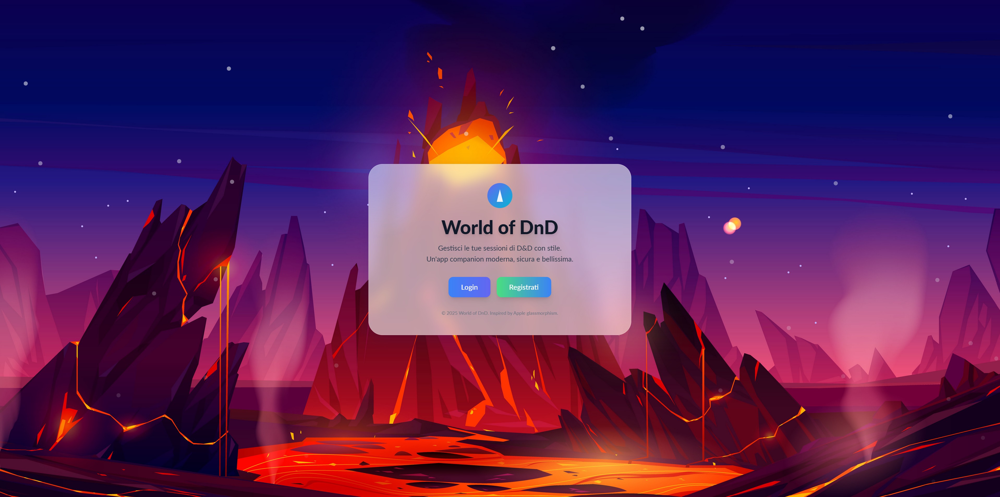
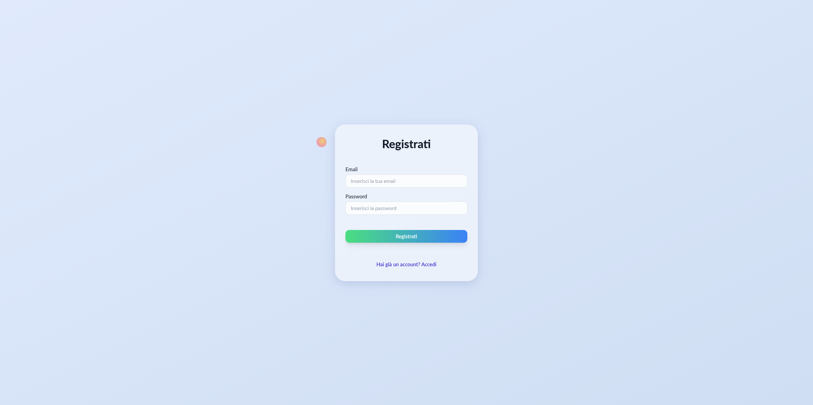
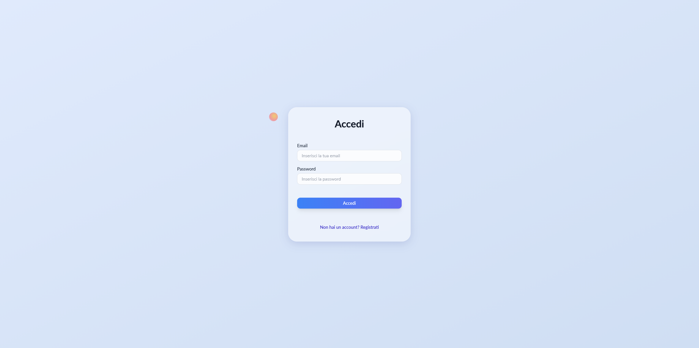

# World of DnD

A companion app for Dungeons and Dragons players. 

The main goal is to reproduce World of Warcraft UI for DnD players to use during their games. It will be a cool character sheet with lot of details!

## How to develop locally

### GIT

Use GIT FLOW to manage the branches.
- `master` branch is the production ready code
- `develop` branch is the integration branch for features
- Create feature branches from `develop` named `feature/your-feature-name`
- When the feature is complete, create a Pull Request to `develop` branch
- Once a milestone is complete, create a Release branch from `develop`, test it and then create a Pull Request to `master` branch. Don't forget to tag the release.
- Hotfix branches can be created from `master` branch named `hotfix/your-hotfix-name` and then create a Pull Request to `master` and `develop` branches.

### Frontend

```
cd world-of-dnd-frontend
npm install
npm run start
```

Open the browser at `http://localhost:4200`.
To develop the game-session component, directly open `http://localhost:4200/game-session/1`. Backend is not yet connected.

### Backend

```
cd world-of-dnd-backend
npm install
npm run start
```

The backend will run at `http://localhost:3000`. 
Use Postman or similar tool to test the endpoints.

## How to run the app (placeholder, do not use yet)

1. Clone the repository
2. Run `docker-compose -p world-of-dnd up -d`
3. Open your browser and go to `http://localhost:8081`

## Warning

At the moment of the first start, the database will be empty (no spells, no auth, no save). I will consider to add a seed script in the future.

## Milestones

1. Recreate a static version of the UI
2. Add a backend to store the data (differentiated by 3.5 and 5e) and authentication features.
3. Add a way to store the current progress (character info, saved spells on spellbar etc...) (at the moment stored locally in the browser)
5. Add a way to share the character with the DM
6. To be continued...

## Screenshots




<video src="https://youtu.be/c4WA-ZxJJSA" width="300" />